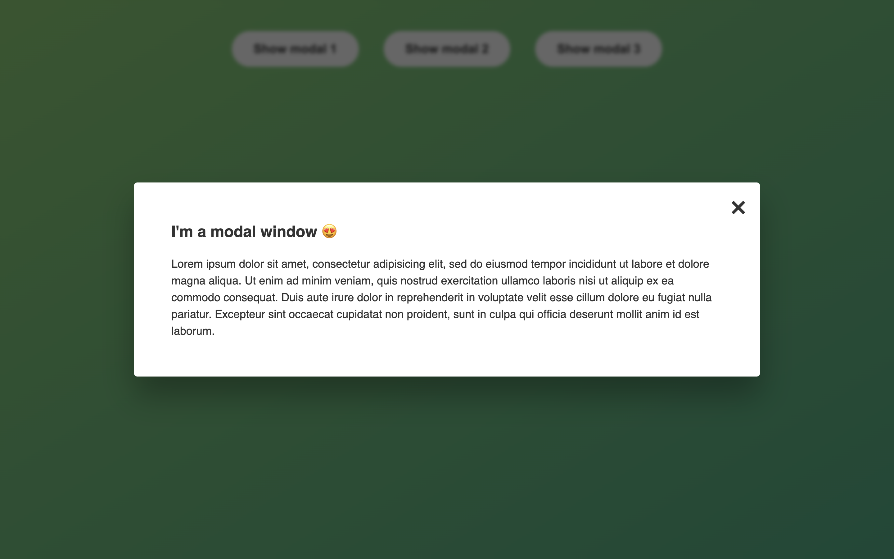

<h1 align="center">📁 Model Window 🪟</h1>

Model Window is a simple and easy to use model window for any purpose. It is a fully responsive model window that can be used for any purpose like login, signup, or any other purpose.

  
  

Click [here](https://rajeev-modalwindow.netlify.app/) and test out Model Window.

## Features and Interfaces

- Open and Close Model Window with a single click on the button.

- Exit Model Window by clicking on the close icon or anywhere outside the Model Window or by pressing the escape key.

- Use the Model Window for any purpose like login, signup, or any other purpose.

## Tech stack

#### Frontend

- JavaScript
- CSS
- HTML
- Markdown

#### Other Tools

- VS Code
- Prettier
- Netlify
- Git

## Points to remember while testing the WebApp

1. First of all fork this [Repository](https://github.com/beRajeevKumar/Modal-Window.git) and clone it.
2. Drag the project into VS Code.
3. Click to the [Live Server](https://marketplace.visualstudio.com/items?itemName=ritwickdey.LiveServer) extension and run the index.html file.
4. The app is now running, Now you can test the Website.

## Useful Links

- [Project Demo](https://rajeev-modalwindow.netlify.app/) for Web Version.

- [Project Repository](https://github.com/beRajeevKumar/Modal-Window.git)

## Need help?

Feel free to contact me on [Twitter](https://twitter.com/be_rajeevkumar) or [LinkedIn](https://www.linkedin.com/in/berajeevkumar/), know more about me at [Portfolio](https://iamrajeev.me).

<h1 align=center>Happy Coding 👨‍💻</h1>
